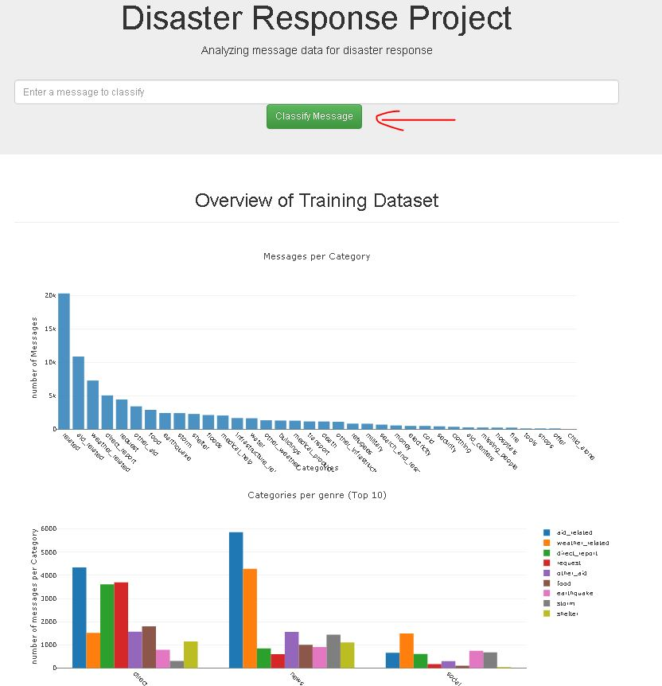

# Disaster Response Pipeline Project

In this project with the pre-trained messages from disaster period, we build an web application with the optimized classifier to predict in which response category the new come message is more likely to belong, in order to reduce the potential reaction time of the responding organizations.

### Instructions:
1. Run the following commands in the project's root directory to set up your database and model.

    - To run ETL pipeline that cleans data and stores in database
        `python data/process_data.py data/disaster_messages.csv data/disaster_categories.csv data/DisasterResponse.db`
    - To run ML pipeline that trains classifier and saves
        `python models/train_classifier.py data/DisasterResponse.db models/classifier.pkl`

2. Run the following command in the app's directory to run your web app.
    `python run.py`

3. Go to http://0.0.0.0:3001/, you can try with new message with 'Classify Message'.

## Code structure

- `app/`
  - `template/`
    - `master.html`  -  Main page of web application.
    - `go.html`  -  Classification result page of web application.
  - `run.py`  - Flask applications main file.

- `data/`
  - `disaster_categories.csv`  - Disaster categories dataset.
  - `disaster_messages.csv`  - Disaster Messages dataset.
  - `process_data.py` - The data processing pipeline script.
  - `DisasterResponse.db`  - The database with the merged and cleand data. (This file is generated)

- `models/`
  - `train_classifier.py` - The NLP and ML pipeline script.

 - `pics/` 
 	- `index.JPG` - index demo picture file
  
